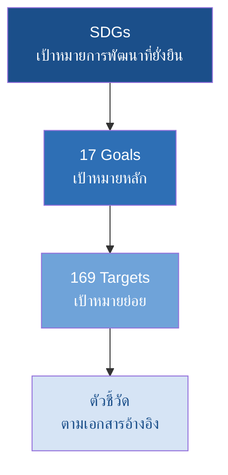

# Tutorial: ใช้ ChatGPT สรุป PDF → Infographic → สไลด์ PPTX
**กรณีศึกษา: เอกสาร SDGs 17 Goals / 169 Targets / 248 KPI (กรมการปกครอง กระทรวงมหาดไทย)**

> ใช้ต่อจากสไลด์ 33–34 (การสร้างคอนเทนต์) และเชื่อมกับกิจกรรมที่ 2 (Prompt Battle เรื่อง SDGs)
> ทุกกล่องโค้ดในไฟล์นี้ **ก๊อบวางลง ChatGPT ได้ทันที**

---

## ⚠️ อ่านก่อนเริ่ม

**ต้องดาวน์โหลด PDF แล้วอัปโหลดเข้า ChatGPT ด้วยตัวเอง** — อย่าแค่วางลิงก์ให้ AI

เหตุผล:
- เว็บไซต์ราชการหลายแห่งบล็อกการเข้าถึงอัตโนมัติ AI จะเปิดไม่ได้
- ถ้า AI เปิดลิงก์ไม่ได้ มันมักจะ **ตอบจากความจำแทน** โดยไม่บอก → ได้ตัวเลขที่ดูน่าเชื่อแต่ผิด
- การอัปโหลดไฟล์จริงคือการทำ **Grounded AI** ตามที่สอนในสไลด์ 18 และ 38

**ไฟล์ต้นฉบับ:** `2. ข้อมูลเกี่ยวกับ sdgs (17goal 169target 248kpi).pdf`
ที่ http://pad.moi.go.th/images/form-download/

> 📌 หมายเหตุเรื่องตัวเลข: กรอบ SDGs สากลมี **17 Goals / 169 Targets** ส่วนจำนวนตัวชี้วัดต่างกันตามแหล่ง (UN global framework ระบุ 231 ตัวชี้วัดที่ไม่ซ้ำ ขณะที่เอกสารฉบับนี้ระบุ 248) — **ให้ยึดตัวเลขจากไฟล์ที่อัปโหลด** และเป็นตัวอย่างที่ดีมากสำหรับสอนเรื่องการตรวจสอบแหล่งข้อมูล

---

## ภาพรวม Workflow

```text
PDF ต้นฉบับ
   ↓ ① อัปโหลด + สรุปแบบ Grounded
สรุปที่ตรวจสอบได้
   ↓ ② สกัดโครงสร้างเป็น JSON
ข้อมูลที่เครื่องอ่านได้
   ↓ ③ ออกแบบ Infographic
ภาพ 1 ชิ้น
   ↓ ④ สร้างสไลด์ PPTX
ไฟล์ .pptx ที่แก้ไขต่อได้
   ↓ ⑤ ตรวจสอบ
งานที่ส่งได้จริง
```

---

## ① สรุป PDF แบบ Grounded

อัปโหลดไฟล์ แล้วก๊อบ Prompt นี้:

```text
ฉันแนบเอกสาร SDGs ของกรมการปกครองมาให้

สรุปเอกสารนี้โดยใช้ข้อมูลจากไฟล์เท่านั้น แยกเป็น 5 ส่วน:

1. ภาพรวมโครงสร้าง — มีกี่ Goal กี่ Target กี่ตัวชี้วัด (ระบุตัวเลขตามที่เอกสารเขียนไว้จริง)
2. ชื่อ Goal ทั้งหมด พร้อมหมายเลข
3. การจัดกลุ่ม Goal ตามมิติ (ถ้าเอกสารมีการจัดกลุ่มไว้)
4. ประเด็นที่เกี่ยวข้องกับบทบาทของกรมการปกครอง
5. คำศัพท์เฉพาะที่ควรรู้ พร้อมนิยามจากเอกสาร

ข้อกำหนด:
- ใช้เฉพาะเนื้อหาในไฟล์ ห้ามเติมความรู้ภายนอก
- ทุกตัวเลขให้ระบุว่าอยู่หน้าไหนของเอกสาร
- ถ้าข้อมูลใดไม่มีในไฟล์ ให้เขียนว่า "ไม่พบในเอกสาร"
```

**เช็คก่อนไปต่อ:** ถ้า ChatGPT ตอบโดยไม่อ้างหน้าเลย แปลว่าอาจตอบจากความจำ ให้ถามย้ำ:
```text
ยืนยันอีกครั้ง ข้อมูลข้างต้นมาจากไฟล์ที่ฉันแนบทั้งหมดใช่หรือไม่
ระบุหน้าที่พบของแต่ละตัวเลข ถ้าหาไม่เจอในไฟล์ให้บอกตรง ๆ
```

---

## ② สกัดโครงสร้างเป็น JSON

ขั้นนี้สำคัญ เพราะ JSON เอาไปสร้างทั้ง Infographic และ PPTX ได้โดยไม่ต้องพิมพ์ซ้ำ

```text
จากเอกสารที่แนบ สกัดข้อมูลออกมาเป็น JSON ตาม schema นี้

{
  "framework": "SDGs",
  "source": "ชื่อเอกสารและหน่วยงาน",
  "summary": {
    "goals": ตัวเลข,
    "targets": ตัวเลข,
    "indicators": ตัวเลข
  },
  "goals": [
    {
      "number": 1,
      "title_th": "",
      "title_en": "",
      "dimension": "People / Planet / Prosperity / Peace / Partnership",
      "key_targets": ["", ""]
    }
  ]
}

ข้อกำหนด:
- ตอบเป็น JSON อย่างเดียว ไม่ต้องมีคำอธิบายนำหรือปิดท้าย
- ถ้าฟิลด์ใดไม่มีข้อมูลในเอกสาร ให้ใส่ค่าเป็น null
- ห้ามเดาชื่อ Goal จากความรู้ทั่วไป ให้ใช้ชื่อตามเอกสาร
```

**ตรวจ:** เปิดดู JSON แล้วสุ่มเช็ค 3 Goal เทียบกับ PDF ด้วยตา

---

## ③ สร้าง Infographic

### 3.1 เลือกโครงสร้างก่อนสั่งสร้างภาพ

```text
จากข้อมูล SDGs ที่สกัดมา ฉันจะทำ infographic 1 ชิ้นสำหรับนักศึกษาปริญญาตรี

เสนอโครงสร้างการนำเสนอ 3 แบบที่เป็นไปได้
สำหรับแต่ละแบบให้ระบุ:
- ชื่อโครงสร้าง (เช่น Hierarchy, Grid, Cycle)
- เหมาะกับการสื่อสารประเด็นอะไร
- ข้อจำกัด

จากนั้นแนะนำแบบที่ดีที่สุด พร้อมเหตุผล
```

> โครงสร้างที่มักเหมาะกับ SDGs: **Grid 17 ช่อง** (เห็นครบ) · **Hierarchy** (Goal → Target → KPI) · **5 Dimensions** (จัดกลุ่ม 5P)

### 3.2 Prompt สร้างภาพ (แก้หัวข้อได้)

```text
Create a clean infographic for a university lecture slide

SUBJECT: SDGs framework hierarchy showing 17 Goals, 169 Targets, 248 Indicators
STRUCTURE: three-level pyramid, largest level at the bottom
STYLE: flat vector, editorial, blue and white palette, rounded corners
TYPOGRAPHY: large readable numbers with short labels underneath
COMPOSITION: centered, generous white space
ASPECT RATIO: 16:9
CONSTRAINTS: no logos, no watermark, no small unreadable text

Note: leave the number labels as placeholders that I can edit later
```

> ⚠️ **AI มักสะกดตัวเลขและข้อความในภาพผิด** — อย่าให้ AI ใส่ตัวเลขสำคัญลงในภาพโดยตรง ให้สร้างภาพเป็นโครงเปล่าแล้วพิมพ์ตัวเลขทับใน Canva/PowerPoint จะแม่นกว่า

### 3.3 ทางเลือกที่ควบคุมได้มากกว่า

| เครื่องมือ | เหมาะกับ | ข้อดี |
|---|---|---|
| **Napkin AI** | แปลงข้อความเป็น diagram | ข้อความคมชัด แก้ไขได้ทีละองค์ประกอบ |
| **Canva Magic Studio** | Infographic ที่ต้องคุมแบรนด์ | มี template และแก้ข้อความง่าย |
| **ChatGPT + Mermaid** | แผนภาพลำดับชั้น | เป็นโค้ด ตรวจสอบและแก้ได้ 100% |

**Prompt สำหรับ Mermaid (ตัวเลขไม่มีทางผิด):**
```text
สร้างโค้ด Mermaid diagram แสดงโครงสร้าง SDGs
ระดับที่ 1: SDGs
ระดับที่ 2: 17 Goals
ระดับที่ 3: 169 Targets
ระดับที่ 4: 248 Indicators

ใช้ flowchart แนวตั้ง ตอบเป็นโค้ด Mermaid อย่างเดียว
```

---

## ④ สร้างสไลด์ PPTX

### วิธีที่ 1 — ให้ ChatGPT สร้างไฟล์ .pptx ให้เลย (ต้องเปิด Data Analysis)

```text
จาก JSON ที่สกัดไว้ ให้สร้างไฟล์ PowerPoint (.pptx) ด้วย python-pptx

โครงสไลด์ 8 หน้า:
1. หน้าปก: SDGs คืออะไร
2. โครงสร้าง 3 ระดับ: Goals / Targets / Indicators พร้อมตัวเลข
3-7. Goal แบ่งตาม 5 มิติ (People Planet Prosperity Peace Partnership) มิติละ 1 สไลด์
8. บทบาทของหน่วยงานท้องถิ่นและสรุป

ข้อกำหนดการออกแบบ:
- ขนาด 16:9
- ธีมสีขาว-น้ำเงิน ตัวอักษรอ่านง่าย
- แต่ละสไลด์มีหัวข้อ 1 บรรทัด และ bullet ไม่เกิน 5 ข้อ
- ใส่ speaker notes ทุกสไลด์
- ใช้ฟอนต์ที่รองรับภาษาไทย

สร้างไฟล์แล้วให้ฉันดาวน์โหลด
```

**ปัญหาที่เจอบ่อยและวิธีแก้:**

| อาการ | วิธีแก้ |
|---|---|
| ภาษาไทยเป็นสี่เหลี่ยม □□□ | สั่งเพิ่ม: `ใช้ฟอนต์ Sarabun หรือ Noto Sans Thai และฝังฟอนต์ในไฟล์` |
| ข้อความล้นกรอบ | สั่ง: `จำกัด bullet ไม่เกิน 5 ข้อ ข้อละไม่เกิน 15 คำ` |
| สไลด์เปล่าท้ายไฟล์ | สั่ง: `ลบ layout ที่ไม่ได้ใช้ออก` |

### วิธีที่ 2 — สร้างเองด้วย python-pptx (คุมได้เต็มที่)

ให้ ChatGPT สร้าง outline เป็น JSON ก่อน แล้วรันสคริปต์นี้เอง:

```python
from pptx import Presentation
from pptx.util import Inches, Pt
from pptx.dml.color import RGBColor
import json

# outline.json มาจากขั้นที่ 2 หรือให้ ChatGPT สร้างตาม schema นี้
# [{"title": "...", "bullets": ["...", "..."], "notes": "..."}]
slides = json.load(open("outline.json", encoding="utf-8"))

BLUE = RGBColor(0x1B, 0x4F, 0x8A)
FONT = "Sarabun"          # ต้องติดตั้งฟอนต์ในเครื่องก่อน

prs = Presentation()
prs.slide_width  = Inches(13.333)   # 16:9
prs.slide_height = Inches(7.5)

for s in slides:
    slide = prs.slides.add_slide(prs.slide_layouts[1])

    # หัวข้อ
    title = slide.shapes.title
    title.text = s["title"]
    p = title.text_frame.paragraphs[0]
    p.font.name = FONT
    p.font.size = Pt(34)
    p.font.bold = True
    p.font.color.rgb = BLUE

    # เนื้อหา
    body = slide.placeholders[1].text_frame
    body.clear()
    for i, b in enumerate(s["bullets"]):
        para = body.paragraphs[0] if i == 0 else body.add_paragraph()
        para.text = b
        para.font.name = FONT
        para.font.size = Pt(20)
        para.level = 0

    # speaker notes
    slide.notes_slide.notes_text_frame.text = s.get("notes", "")

prs.save("sdgs_summary.pptx")
print("saved: sdgs_summary.pptx")
```

> 💡 ฟอนต์ไทยฟรีที่ใช้ได้: **Sarabun** และ **Noto Sans Thai** จาก Google Fonts
> ถ้าเปิดไฟล์ในเครื่องที่ไม่มีฟอนต์ ตัวอักษรจะเพี้ยน → แนะนำ export เป็น PDF ตอนนำเสนอจริง

### วิธีที่ 3 — ผ่าน Canva / Gamma
ให้ ChatGPT สร้าง outline เป็น Markdown แล้ว import เข้า Canva หรือ Gamma
ข้อดี: ดีไซน์สวยกว่า · ข้อเสีย: แก้โครงสร้างทีหลังยากกว่า

---

## ⑤ ตรวจสอบก่อนใช้งาน (ห้ามข้าม)

```text
ตรวจสอบสไลด์ที่สร้างขึ้นเทียบกับเอกสาร PDF ต้นฉบับที่ฉันแนบไว้

สำหรับแต่ละสไลด์ ให้ระบุ:
1. ตัวเลขทุกตัวตรงกับเอกสารหรือไม่ ถ้าไม่ตรงให้ชี้ว่าต่างอย่างไร
2. มีข้อความใดที่ไม่ได้มาจากเอกสารแต่คุณเติมเข้าไปเอง
3. มีประเด็นสำคัญในเอกสารที่ยังไม่ได้ขึ้นสไลด์

ตอบเป็นตาราง และห้ามแก้ไฟล์จนกว่าฉันจะยืนยัน
```

### Checklist ส่งงาน
- [ ] ตัวเลข 17 / 169 / 248 ตรงกับเอกสารต้นฉบับ (เปิด PDF เทียบด้วยตา)
- [ ] ชื่อ Goal ทุกข้อสะกดถูกและตรงกับเอกสาร
- [ ] ตัวเลขในภาพ Infographic ถูกต้อง (จุดที่ AI ผิดบ่อยที่สุด)
- [ ] ภาษาไทยไม่เป็น □□□ ในเครื่องที่จะใช้นำเสนอจริง
- [ ] ระบุแหล่งที่มาของเอกสารในสไลด์สุดท้าย
- [ ] เขียน AI Disclosure ตามนโยบายรายวิชา

**ตัวอย่าง AI Disclosure สำหรับงานนี้:**
> ผู้จัดทำใช้ ChatGPT ช่วยสรุปเอกสารและสร้างโครงสไลด์จากไฟล์ PDF ต้นฉบับของกรมการปกครอง ผู้จัดทำตรวจสอบตัวเลขและชื่อเป้าหมายทุกข้อกับเอกสารต้นฉบับด้วยตนเอง

---

## นำไปใช้ในห้องเรียนอย่างไร

| ใช้เป็น | รายละเอียด | เวลา |
|---|---|---|
| **ต่อยอดกิจกรรมที่ 2** | Prompt Battle ใช้หัวข้อ SDGs อยู่แล้ว ให้กลุ่มที่ชนะทำต่อเป็นสไลด์จริง | 15 นาที |
| **การบ้านหลังอบรม** | ทำครบทั้ง 5 ขั้น ส่งไฟล์ .pptx + บันทึกการตรวจสอบ | 1 สัปดาห์ |
| **Demo หน้าห้อง** | สาธิตแค่ขั้น ① และ ⑤ ให้เห็นว่า Grounded ต่างจากถามลอยอย่างไร | 5 นาที |

**จุดสอนที่ทรงพลังที่สุด:** ให้นักศึกษาลองถามคำถามเดียวกัน **2 แบบ** — แบบไม่แนบไฟล์ กับแบบแนบไฟล์ แล้วเทียบว่าตัวเลขตรงกันไหม นี่คือบทเรียนเรื่อง Hallucination และ RAG ที่เห็นผลชัดที่สุด

---

## แหล่งอ้างอิง

- เอกสารต้นฉบับ: กรมการปกครอง กระทรวงมหาดไทย — http://pad.moi.go.th/
- UN Sustainable Development Goals — https://sdgs.un.org/goals
- python-pptx documentation — https://python-pptx.readthedocs.io/
- ฟอนต์ไทย Sarabun / Noto Sans Thai — https://fonts.google.com/


---

# ภาคผนวก A — ตัวอย่างพร้อมใช้ (ไม่ต้องรอไฟล์ PDF)

> ใช้ส่วนนี้เมื่อต้องการซ้อมก่อน หรือเมื่อยังไม่ได้ดาวน์โหลด PDF
> **แต่ตอนทำงานจริง ให้ยึดข้อมูลจากไฟล์ที่อัปโหลดเสมอ** ตัวเลขและถ้อยคำในเอกสารราชการอาจต่างจากกรอบสากล

## A.1 โครงสร้าง SDGs 17 เป้าหมาย

| # | ชื่อภาษาไทย | ชื่อภาษาอังกฤษ | มิติ (5P) |
|---|---|---|---|
| 1 | ขจัดความยากจน | No Poverty | People |
| 2 | ขจัดความหิวโหย | Zero Hunger | People |
| 3 | สุขภาพและความเป็นอยู่ที่ดี | Good Health and Well-being | People |
| 4 | การศึกษาที่มีคุณภาพ | Quality Education | People |
| 5 | ความเท่าเทียมทางเพศ | Gender Equality | People |
| 6 | น้ำสะอาดและสุขาภิบาล | Clean Water and Sanitation | Planet |
| 7 | พลังงานสะอาดที่เข้าถึงได้ | Affordable and Clean Energy | Prosperity |
| 8 | งานที่มีคุณค่าและการเติบโตทางเศรษฐกิจ | Decent Work and Economic Growth | Prosperity |
| 9 | โครงสร้างพื้นฐาน นวัตกรรม อุตสาหกรรม | Industry, Innovation and Infrastructure | Prosperity |
| 10 | ลดความเหลื่อมล้ำ | Reduced Inequalities | Prosperity |
| 11 | เมืองและชุมชนที่ยั่งยืน | Sustainable Cities and Communities | Prosperity |
| 12 | การผลิตและบริโภคที่ยั่งยืน | Responsible Consumption and Production | Planet |
| 13 | การรับมือกับการเปลี่ยนแปลงสภาพภูมิอากาศ | Climate Action | Planet |
| 14 | ทรัพยากรทางทะเล | Life Below Water | Planet |
| 15 | ระบบนิเวศบนบก | Life on Land | Planet |
| 16 | สังคมสงบสุข ยุติธรรม สถาบันเข้มแข็ง | Peace, Justice and Strong Institutions | Peace |
| 17 | ความร่วมมือเพื่อการพัฒนาที่ยั่งยืน | Partnerships for the Goals | Partnership |

> ⚠️ **จุดที่ต้องตรวจกับ PDF เสมอ:** จำนวนตัวชี้วัด — เอกสารฉบับนี้ระบุ 248 KPI ขณะที่กรอบสากลของ UN ระบุตัวชี้วัดที่ไม่ซ้ำกัน 231 ตัว ตัวเลขต่างกันได้ตามวิธีนับและเวอร์ชันของกรอบ **ให้ใช้ตัวเลขจากเอกสารที่อัปโหลด** และนี่เป็นตัวอย่างสอนเรื่องการตรวจสอบแหล่งข้อมูลที่ดีมาก

## A.2 ไฟล์ outline.json ตัวอย่าง

บันทึกเป็น `outline.json` แล้วใช้กับสคริปต์ในหัวข้อ ④ ได้ทันที

```json
[
  {
    "title": "SDGs คืออะไร",
    "bullets": [
      "เป้าหมายการพัฒนาที่ยั่งยืนขององค์การสหประชาชาติ",
      "กรอบระยะเวลา ค.ศ. 2015 ถึง 2030",
      "ใช้เป็นกรอบอ้างอิงร่วมกันทั่วโลก",
      "ประเทศไทยรายงานความคืบหน้าตามกรอบนี้"
    ],
    "notes": "เปิดด้วยคำถามว่าใครเคยเห็นสัญลักษณ์ 17 สีมาก่อน แล้วโยงเข้าเนื้อหา"
  },
  {
    "title": "โครงสร้าง 3 ระดับ",
    "bullets": [
      "ระดับที่ 1 Goals เป้าหมายหลัก",
      "ระดับที่ 2 Targets เป้าหมายย่อยที่วัดผลได้",
      "ระดับที่ 3 Indicators ตัวชี้วัดสำหรับติดตาม",
      "ตัวเลขให้ยึดตามเอกสารต้นฉบับที่ใช้อ้างอิง"
    ],
    "notes": "ย้ำว่าตัวเลขตัวชี้วัดต่างกันตามแหล่ง ให้ตรวจกับเอกสารที่ใช้จริงเสมอ"
  },
  {
    "title": "มิติ People",
    "bullets": [
      "Goal 1 ขจัดความยากจน",
      "Goal 2 ขจัดความหิวโหย",
      "Goal 3 สุขภาพและความเป็นอยู่ที่ดี",
      "Goal 4 การศึกษาที่มีคุณภาพ",
      "Goal 5 ความเท่าเทียมทางเพศ"
    ],
    "notes": "มิตินี้เน้นคน ยกตัวอย่างที่นักศึกษาเห็นได้ในชุมชนของตัวเอง"
  }
]
```

## A.3 สคริปต์ฉบับเต็มที่รันได้ทันที

```python
"""
สร้างสไลด์ SDGs จาก outline.json
ติดตั้งก่อน: pip install python-pptx
"""
from pptx import Presentation
from pptx.util import Inches, Pt
from pptx.dml.color import RGBColor
import json, os

OUTLINE = "outline.json"
OUTPUT  = "sdgs_summary.pptx"
FONT    = "Sarabun"                    # ต้องติดตั้งฟอนต์ในเครื่อง
BLUE    = RGBColor(0x1B, 0x4F, 0x8A)
GRAY    = RGBColor(0x33, 0x33, 0x33)

with open(OUTLINE, encoding="utf-8") as fh:
    slides = json.load(fh)

prs = Presentation()
prs.slide_width  = Inches(13.333)      # 16:9
prs.slide_height = Inches(7.5)

def style(paragraph, size, color, bold=False):
    paragraph.font.name  = FONT
    paragraph.font.size  = Pt(size)
    paragraph.font.bold  = bold
    paragraph.font.color.rgb = color

for item in slides:
    slide = prs.slides.add_slide(prs.slide_layouts[1])

    slide.shapes.title.text = item["title"]
    style(slide.shapes.title.text_frame.paragraphs[0], 34, BLUE, bold=True)

    body = slide.placeholders[1].text_frame
    body.clear()
    body.word_wrap = True
    for i, bullet in enumerate(item.get("bullets", [])):
        para = body.paragraphs[0] if i == 0 else body.add_paragraph()
        para.text  = bullet
        para.level = 0
        style(para, 20, GRAY)

    slide.notes_slide.notes_text_frame.text = item.get("notes", "")

prs.save(OUTPUT)
print(f"สร้างเสร็จ: {os.path.abspath(OUTPUT)}  ({len(slides)} สไลด์)")
```

**รันด้วย:**
```bash
pip install python-pptx
python make_sdgs_deck.py
```

## A.4 Mermaid สำหรับแผนภาพโครงสร้าง

ตัวเลขในภาพจะไม่มีทางผิด เพราะเราพิมพ์เอง ไม่ได้ให้ AI วาด



> วางโค้ดนี้ที่ https://mermaid.live เพื่อ export เป็น PNG หรือ SVG

---

# ภาคผนวก B — ทำงานเดียวกันนี้ด้วย Claude Cowork

ถ้ามีแผน Claude แบบเสียเงิน งานทั้ง 5 ขั้นทำได้ในคำสั่งเดียว (ดูรายละเอียดใน `tutorial_claude_cowork_skills_th.md`)

```text
ในโฟลเดอร์นี้มีไฟล์ SDGs.pdf

งานที่ต้องการ:
1. อ่านเอกสารแล้วสกัดโครงสร้าง Goals Targets และตัวชี้วัดเป็น JSON
2. สร้างไฟล์ PowerPoint 8 สไลด์ ขนาด 16:9 ฟอนต์ Sarabun ธีมขาวน้ำเงิน
3. ใส่ speaker notes ทุกสไลด์
4. สร้างไฟล์ตรวจสอบ verification.md ที่เทียบทุกตัวเลขในสไลด์กับหน้าในเอกสาร

ข้อกำหนด:
- ใช้เฉพาะข้อมูลจากไฟล์ PDF ห้ามเติมจากความรู้ภายนอก
- ก่อนสร้างไฟล์ ให้แสดงโครงสไลด์ให้ฉันดูก่อนและรอการยืนยัน
- ทุกตัวเลขให้ระบุหน้าที่พบในเอกสาร
```

**ข้อต่างสำคัญ:** ChatGPT ต้องดาวน์โหลดไฟล์ผลลัพธ์แล้วเปิดเอง ส่วน Cowork เขียนไฟล์ลงโฟลเดอร์ให้เลย และทำงานหลายไฟล์ต่อเนื่องได้ในคำสั่งเดียว
